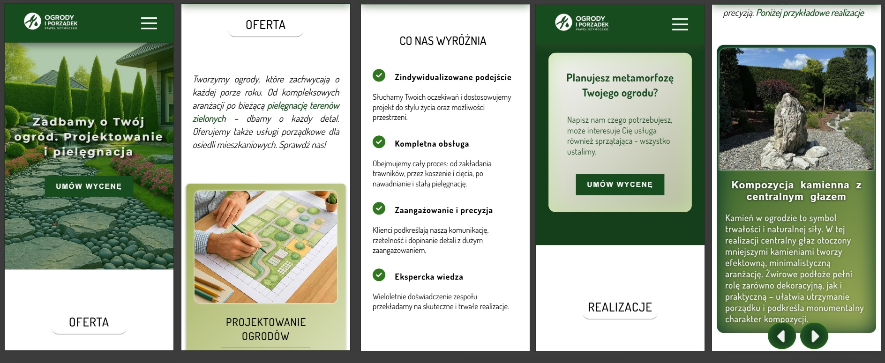
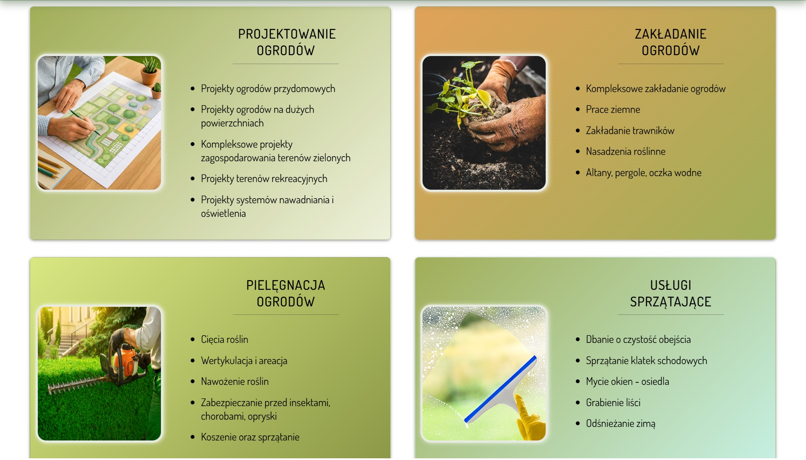
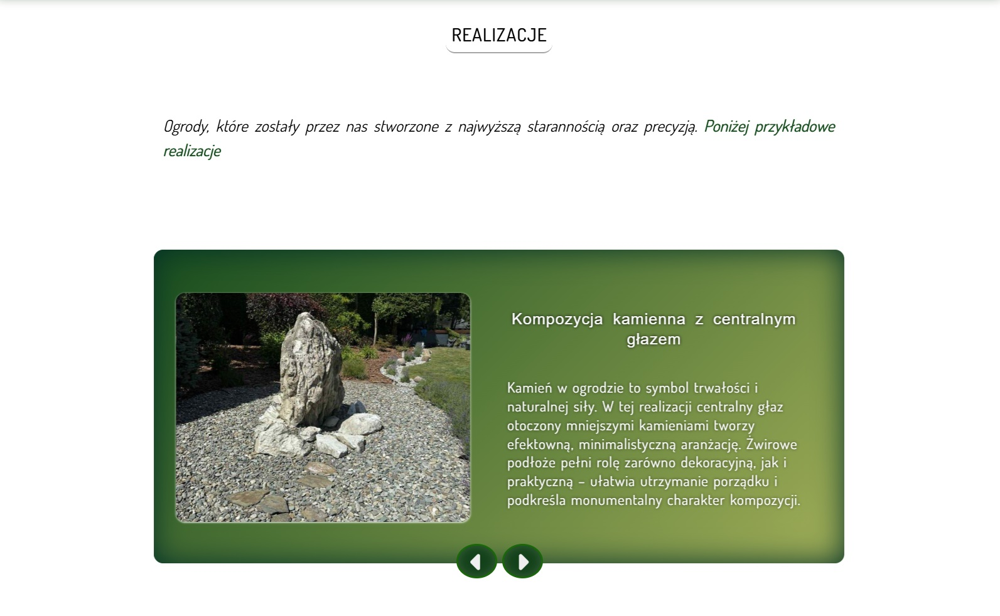
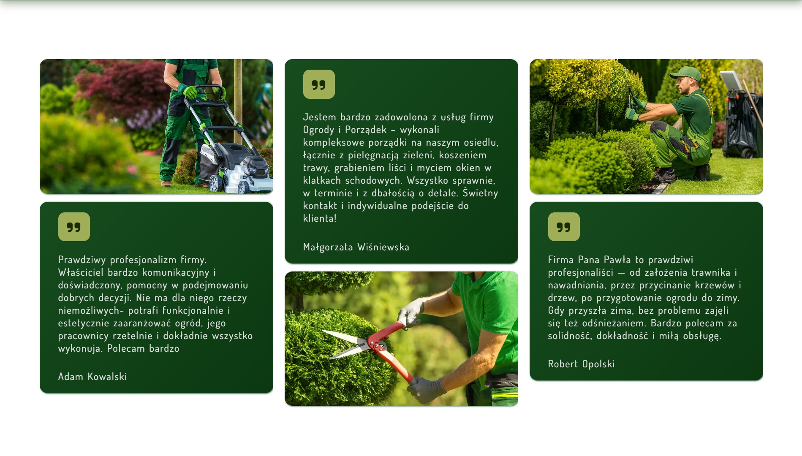
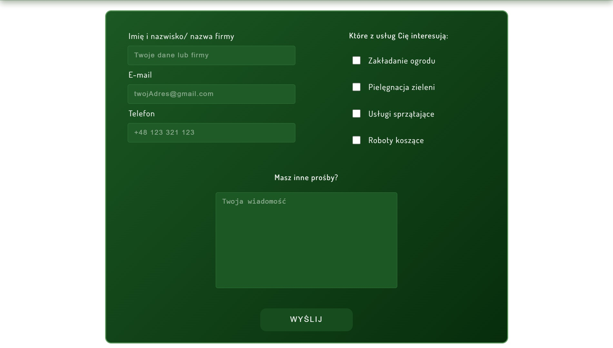

# Ogrody i porządek (Gardens & Cleaning)
Demo - live version available at:
[**Ogrody i porządek – GitHub Pages Demo**](https://wojciechsadowskinwd.github.io/Ogrody-i-porzadek/)

A fully responsive RWD website, designed for mobile devices, dedicated to gardening and cleaning services.  
It is a single-page application (SPA) with a home page and a contact page, designed with an emphasis on performance, proper handling of static resources, TypeScript implementation, and deployment on GitHub Pages.

### Project Goals
- Build a lightweight, attractive, responsive landing page enhanced with smooth animations (Framer Motion)  
- Configure a reliable build process and hosting on GitHub Pages  
- Ensure correct management of static assets (e.g., images) when hosting in a subdirectory  
- Demonstrate practical skills in React, React Router, Redux Toolkit, TypeScript, and custom hook development  

### Technology Stack
- **React 19 + TypeScript 5**  
- **Vite 7** – fast dev server and bundler  
- **React Router** – SPA routing with `basename` support  
- **Redux Toolkit** – global state management (prepared for further extension)  
- **Sass/SCSS** – layout, responsiveness, custom mixins, module files, and variables  
- **Framer Motion** – micro-interaction animations  
- **Form submission mechanics** – basic backend using Node + Express (implemented with external support)  

## Technologies and Solutions Used in the Project
This project was built with a modern React/TypeScript stack.  
Below is an overview of the libraries, React hooks, custom hooks, TypeScript features, and SCSS techniques applied in the codebase.  
The list highlights both the tools used and the specific language/React features I worked with, so you can quickly see the scope of technologies applied in practice.

### Libraries
- **react-redux** – State management
- **react-router-dom** – Routing
- **hamburger-react** – Animated hamburger menu
- **framer-motion** – Animations

#### Core React
- **useState** – Stores and updates local component state  
- **useEffect** – Handles side effects (e.g. data fetching, subscriptions, DOM updates) after rendering  
- **useCallback** – Memoizes functions to prevent unnecessary re-creations on each render  
- **useMemo** – Memoizes computed values to avoid redundant recalculations  
- **useRef** – Persists mutable values across renders (e.g. DOM element references)  

#### React Router
- **useLocation** – Provides information about the current route (path, query params)  
- **useNavigate** – Enables programmatic navigation between routes  

#### React Redux
- **useDispatch** – Returns the `dispatch` function to send actions to the Redux store  
- **useSelector** – Selects data from the Redux store and subscribes to changes  

### Custom Hooks
- **useAutoHideTopbar** – Automatically hides/shows the top bar while scrolling  
- **useDesktopNav** – Detects desktop mode based on window width (default breakpoint: 768px)  
- **useInView** – Observes element visibility in the viewport. Returns a `ref` and an `isVisible` flag (true when at least 20% is visible). Used mainly for triggering animations. Runs once per element.  
- **useScrollTo** – Smoothly scrolls to a specific element by its ID (anchor-like behavior)  
- **useScrollToTop** – Scrolls to the top of the page whenever the route changes  
- **redux.ts** – Typed versions of Redux hooks (`useDispatch`, `useSelector`) bound to the app’s store (`RootState`, `AppDispatch`)  

### TypeScript
- Basic types (`string`, `number`, `boolean`, `null`, `undefined`)  
- Type aliases, interfaces  
- Union types, generics (`<T>`)  
- Optional properties (`prop?: type`)  
- Type assertions (`as`)  
- Utility types (`ReturnType`, `typeof`, `extends`)  
- Typing React props & events (`ReactNode`, `FormEvent`, `HTMLInputElement`, `ComponentPropsWithoutRef`)  
- `CSSProperties` (typing for inline styles)  
- Redux Toolkit typing (`RootState`, `AppDispatch`, `PayloadAction`, `TypedUseSelectorHook`)  
- Import/export types  
- Framer Motion `Variants`  

### SCSS (Sass)
- Variables (`$variable`)  
- Mixins (`@mixin ...`)  
- Module system (`@use`, `@forward`)  
- CSS Modules integration (`*.module.scss`)  

## Screenshots
### Mobile views



### Desktop views (samples – Homepage)





#### Contact page




## Installation

To run the project locally:

1. **Clone the repository**
   ```bash
   git clone https://github.com/WojciechSadowskiNwD/Ogrody-i-porzadek.git
   cd Ogrody-i-porzadek
2. Install dependencies:
   ```bash
   npm install
   # or
   yarn install

3. Start the development Server:
   ```bash
   # backend (server)
   npm run dev
   # frontend (src)
   npm run dev
  *	The app will be available at http://localhost:5173 by default.

4. Build for production:
   ```bash
   npm run build
  *	The optimized production files will be created in the dist/ directory.

## Deployment (GitHub Pages)
This project is configured to run on GitHub Pages.

1.	Update the vite.config.ts file to set the correct base option (subdirectory path):
    ```jsx
    export default defineConfig({
    base: "/Ogrody-i-porzadek/",
    plugins: [react()],
    });

3.	Build the project:
    ```bash
    npm run build

5.	Deploy the contents of the dist/ folder to the gh-pages branch.
You can automate this using the gh-pages package or GitHub Actions.

6.	Ensure basename is set in React Router for proper routing:
    ```jsx
     <BrowserRouter basename="/Ogrody-i-porzadek">
      	 <App />
     </BrowserRouter>


## 📄 License

This project is open source and licensed under the MIT License.  
You are free to use, modify, and distribute it under the terms of this license.
